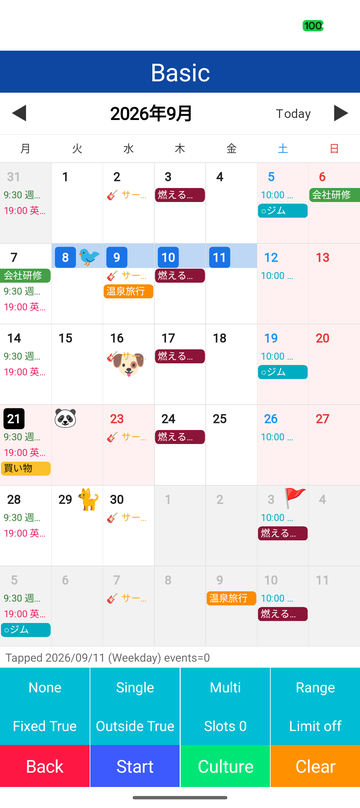
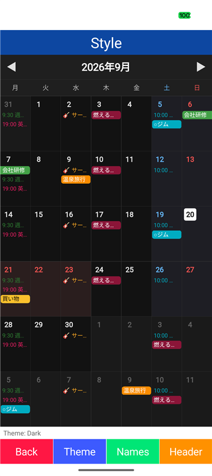

# ClamCalendar - Calendar view for .NET MAUI Android

[](https://www.nuget.org/packages/ClamCalendar/)

## 🐚 What is this?

A .NET MAUI month calendar for Android drawn with SkiaSharp on a single canvas.  
Month building, event placement, selection and touch handling run in C#, so the view stays light and every visual detail is a style value.  

| 📅 Basic | 🎨 Dark style |
|:-:|:-:|
|  |  |

## 🚀 Quick Start

Call `UseSkiaSharp()` when building the application.  

```csharp
var builder = MauiApp.CreateBuilder()
    .UseMauiApp<App>()
    .UseSkiaSharp();
```

Place `ClamCalendarView` in a `*` row of a `Grid` and give it the events of the visible range.  

```xml
<clam:ClamCalendarView DisplayDate="{Binding DisplayDate, Mode=TwoWay}"
                       DisplayDateChangedCommand="{Binding LoadCommand}"
                       Events="{Binding Events}"
                       Holidays="{Binding Holidays}"
                       SelectionMode="SingleDate"
                       SelectedDate="{Binding SelectedDate, Mode=TwoWay}"
                       DayTappedCommand="{Binding DayTappedCommand}" />
```

```csharp
var calendar = new ClamCalendarView { SelectionMode = CalendarSelectionMode.DateRange, TodayButtonVisible = true };
calendar.Events =
[
    new CalendarEvent { Title = "Trip", StartDate = new DateOnly(2026, 9, 14), EndDate = new DateOnly(2026, 9, 16), BackgroundColor = Colors.HotPink },
    new CalendarEvent { Title = "Lesson", StartDate = new DateOnly(2026, 9, 21), EndDate = new DateOnly(2026, 9, 21), Style = CalendarEventStyle.Text, TextColor = Colors.Green, StartTime = new TimeSpan(19, 0, 0) }
];
calendar.Stamps = [new CalendarStamp { Date = new DateOnly(2026, 9, 13), Glyph = "✈️" }];
calendar.DayTapped += (_, e) => Debug.WriteLine(e.Date);
```

Text is drawn with the `sans-serif` system font; characters it lacks are resolved per character through `CalendarFonts`.  
Set a bundled font as a fallback at startup when the device fonts do not cover the language.  

```csharp
CalendarFonts.Languages = ["ja"];
CalendarFonts.Fallbacks = [SKTypeface.FromStream(await FileSystem.OpenAppPackageFileAsync("NotoSansJP-Regular.ttf"))];
```

Swipe horizontally to move between months, tap a day to select it and long press a day to get `DayLongPressed`.  

## 🔗 Binding and MVVM

Every setting a view model needs is a bindable property or a command.  
The view reports the visible date range through `DisplayDateChanged` whenever the month changes, so the events of that range are loaded there.  
`Example/Modules/Calendar` contains complete screens built this way.  

```csharp
public sealed class CalendarViewModel : ObservableObject
{
    private readonly IScheduleRepository repository;

    public DateOnly DisplayDate
    {
        get;
        set
        {
            field = value;
            OnPropertyChanged();
        }
    } = DateOnly.FromDateTime(DateTime.Today);

    public IReadOnlyList<CalendarEvent> Events
    {
        get;
        private set
        {
            field = value;
            OnPropertyChanged();
        }
    } = [];

    public IReadOnlyList<DateOnly> Holidays
    {
        get;
        private set
        {
            field = value;
            OnPropertyChanged();
        }
    } = [];

    public DateOnly? SelectedDate
    {
        get;
        set
        {
            field = value;
            OnPropertyChanged();
        }
    }

    public ICommand LoadCommand { get; }

    public ICommand DayTappedCommand { get; }

    public CalendarViewModel(IScheduleRepository repository)
    {
        this.repository = repository;
        // FirstDate and LastDate cover the days of the neighboring months drawn in the first and last row
        LoadCommand = new Command<CalendarDisplayDateChangedEventArgs>(e =>
        {
            Events = repository.GetEvents(e.FirstDate, e.LastDate);
            Holidays = repository.GetHolidays(e.FirstDate, e.LastDate);
        });
        DayTappedCommand = new Command<CalendarDayEventArgs>(e => Debug.WriteLine($"{e.Date} {e.Day.Events.Count} events"));
    }
}
```

| Task | Binding |
|---|---|
| Month | `DisplayDate` (TwoWay), `Navigate` / `GoToToday`, `MinDate` / `MaxDate`, `DisplayDateChangedCommand` |
| Data | `Events`, `Stamps`, `Holidays`, `DayLabels`; `INotifyCollectionChanged` sources redraw on change |
| Layout | `FirstDayOfWeek`, `FixedWeekRows`, `OutsideMonthDaysVisible`, `MaxVisibleSlots`, `Culture`, `WeekdayNameFormat` |
| Header | `HeaderVisible`, `NavigationButtonsVisible`, `TodayButtonVisible`, `HeaderFormat` and the button texts, or `HeaderVisible="False"` with a header of the page |
| Selection | `SelectionMode`, `SelectedDate` / `SelectedStartDate` / `SelectedEndDate` (TwoWay), `SelectedDates`, `AllowDeselect`, `MaxSelectableDays`, `DisabledDates` |
| Input | `DayTappedCommand`, `DayLongPressedCommand`, `EventTappedCommand`, `OverflowTappedCommand` with the same arguments as the events |
| Colors | `CalendarStyle` as a resource or a view model property |

Holiday calculation, event storage and navigation belong to the application.  

## ✅ Supported features

| Category | Detail |
|---|---|
| **Month** | Monday or any other first day of the week, six fixed rows or the rows the month needs, neighboring days shown or blank, month indicator watermark |
| **Events** | Single and multi day events placed across weeks, filled bars or plain text, leading glyph and start time, row limit with `+N` overflow |
| **Days** | Weekend and holiday colors, today mark, small labels such as holiday names, emoji stamps in seven positions |
| **Selection** | None / single date / multiple dates / date range, deselect and count limits, disabled dates and date limits |
| **Navigation** | Header buttons, today button, horizontal swipe with a slide animation, limits by `MinDate` / `MaxDate`, visible range notification |
| **Styling** | Fonts, sizes and colors in `CalendarStyle`, usable as a XAML resource |
| **Fonts** | Per character fallback to `CalendarFonts` typefaces and system fonts, emoji sequences included |
| **Input** | Tap, long press, swipe, commands for MVVM, parent scroll handed over on vertical movement |

## 📖 API

See the [API reference](Document/API.md).  
